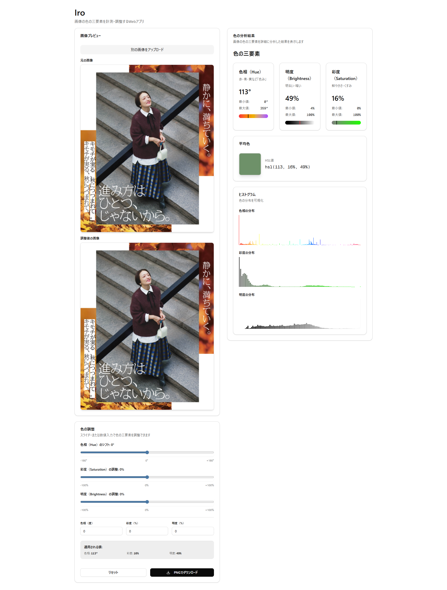

# Iro

画像の色の三要素（色相・明度・彩度）を計測・調整するWebアプリケーションです。



## 機能

- **画像のアップロード**: ドラッグ&ドロップまたはクリックで画像をアップロード
- **色の分析**: 画像の色相（Hue）、明度（Brightness）、彩度（Saturation）を詳細に分析
  - 平均値、最小値、最大値の表示
  - ヒストグラムによる分布の可視化
  - 平均色の表示
- **色の調整**: リアルタイムプレビューで色の三要素を調整
  - 色相のシフト（-180°〜+180°）
  - 彩度の調整（-100%〜+100%）
  - 明度の調整（-100%〜+100%）
- **画像のダウンロード**: 調整後の画像をPNG形式でダウンロード

## セットアップ

### 必要な環境

- Node.js 18以上
- pnpm

### インストール

依存関係をインストールします：

```bash
pnpm install
```

## 開発

開発サーバーを起動します：

```bash
pnpm dev
```

ブラウザで [http://localhost:3000](http://localhost:3000) を開いてアプリケーションを確認できます。

## ビルド

本番用のビルドを作成します：

```bash
pnpm build
```

ビルドしたアプリケーションを起動します：

```bash
pnpm start
```

## 技術スタック

- **フレームワーク**: Next.js 16
- **UIライブラリ**: React 19
- **スタイリング**: Tailwind CSS 4
- **UIコンポーネント**: Radix UI
- **言語**: TypeScript

## ライセンス

このプロジェクトは [GNU Affero General Public License v3.0](https://www.gnu.org/licenses/agpl-3.0.html) の下で公開されています。

詳細は [LICENSE](https://github.com/mshrynzw/aurawork/blob/master/LICENSE) ファイルを参照してください。

## 作者

- **mshrynzw** - [GitHub](https://github.com/mshrynzw)

## 貢献

貢献を歓迎します！プルリクエストを送信する前に、コーディング規約を確認してください。

## セキュリティ

セキュリティの脆弱性を発見した場合は、GitHubのセキュリティアドバイザリを通じて報告してください。